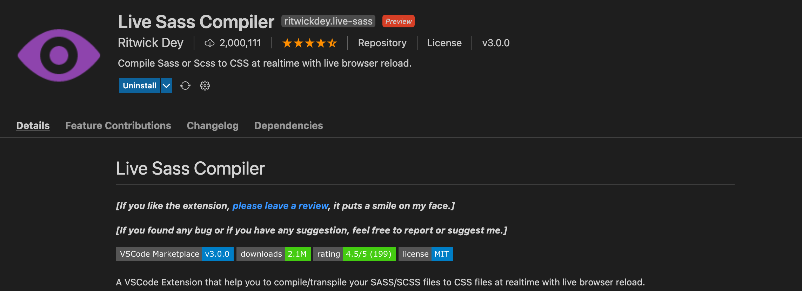

# Sass-Course

> github page를 다시 만들기 위하여 간단하게 유튜브 강의를 통해 Sass를 배우기로 했다.

---

### 링크

- 유튜브 링크: https://www.youtube.com/watch?v=nu5mdN2JIwM&t=364s
- 사이트 링크: https://www.traversymedia.com

---

### What is Sass

- Sass(Syntactically Awesome StyleSheets)
- Css PreProcessor / Extension
- Let's you use features that do not exist in Css
- Sass files are compiled to regular Css

---

### 특징

- $를 통해 변수를 정의할 수 있다.
- Css 와 달리 하위 항목을 괄호 안에 넣는다.(Nesting)

Sass

```css
nav {
  ul {
    margin: 0;
    padding: 0;
  }

  li {
    display: inline-block;
  }
}
```

Css

```css
nav ul {
  margin: 0;
  padding: 0;
}

nav li {
  display: inline-block;
}
```

- 다른 파일을 불러오는 것이 가능하다.(Modules)

```css
/* base.sass */
$front-stack: Helvetica, sans-serif;
$primary-color: #333;

body {
  front: 100% $font-stack;
}
```

```css
/* styles.sass */
@use "base";

.inverse {
  background-color: base.$primary-color;
  color: white;
}
```

- Mixins & Functions

Sass

```css
@mixin transform($property) {
  -webkit-transform: $property;
  -ms-transform: $property;
  transform: $property;
}
.box {@include transform{rotate(30deg)}}
```

Css

```css
.box {
  -webkit-transform: rotate(30deg);
  -ms-transform: rotate(30deg);
  transform: rotate(30deg);
}
```

- Inheritance

```css
/* this css will print because %message-shared is extended. */
%message-shared {
  border: 1px solid #ccc;
  padding: 10px;
  color: #333;
}

.message {
  @extend %message-shared;
}

.success {
  @extend %message-shared;
  border-color: green;
}

.error {
  @extend %message-shared;
  border-color: red;
}

.warning {
  @extend %message-shared;
  border-color: yellow;
}
```

- Conditionals

Sass

```css
@mixin triangle($size, $color, $direction) {
  height: 0;
  width: 0;

  @if $direction == up {
    border-bottom-color: $color;
  } @else if $direction == right {
    border-left-color: $color;
  } @else if $direction == down {
    border-top-color: $color;
  } @ else if $direction == left {
    border-right-color: $color;
  } @else {
    @error "Unknown direction #{$direction}."
  }
}

.next {
  @include trianfle(5px, black, right);
}
```

Css

```css
.next {
  height: 0;
  width: 0;
  border-left-color: black;
}
```

---

### Live Sass Compiler

Live Sass Compiler을 설치하면 번거롭게 매번 컴파일 할 필요없이 sass를 수정할 때마다 자동으로 컴파일된다.


---

### Image


